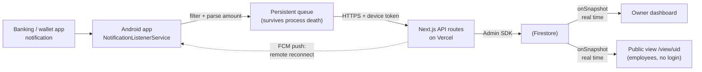

# NListener

Cross-platform SaaS: a native Android app captures banking/payment notifications on a user's phone and syncs them in real time to a web dashboard — built for businesses that want employees to see incoming transfers without accessing the actual bank account or wallet app.

🔗 **Live:** [www.nlistener.com.ar](https://www.nlistener.com.ar)

---

## Screenshots


## The problem

In Argentina, a large share of retail payments are bank or wallet transfers. The cashier has to confirm the money actually arrived before handing over the product — but the payment only shows up as a notification on the **owner's** phone, inside the **owner's** banking app.

Every workaround is bad: handing employees the phone, sharing banking credentials, or having the owner confirm each sale by hand.

NListener captures just the payment notification and mirrors it to a shareable, read-only dashboard. Employees see transfers arrive in real time. Nobody touches the bank account.

## What it does



1. **The owner registers** on the web app and verifies their email.
2. **Installs the Android app** on the phone where bank notifications arrive.
3. **Scans a QR code** from the dashboard — the phone is paired to the account with a unique device token. No login inside the app.
4. **Payments are captured automatically** — `NotificationListenerService` picks up notifications from the selected apps, discards anything that isn't an incoming payment, parses the amount and posts it to the API.
5. **Employees open a shared link** — payments appear in real time, no account needed.

## Features

**Core**
- Real-time payment feed via Firestore snapshot listeners
- Supports the major Argentine payment apps: Mercado Pago, Galicia, Ualá, Naranja X, Brubank, Santander, BBVA, Macro, ICBC, Personal Pay
- Public shareable link for employees — read-only, no login
- QR-based device pairing
- Payment detection that filters out promos, outgoing payments, ads and balance notices
- Quick client-side search over loaded rows, plus an on-demand "search the whole day / full history" query

**Reliability**
- Persistent on-disk queue written *before* the network call — nothing is lost to process death
- **WorkManager** retries failed sends with exponential backoff when the network recovers
- **KeepAliveService** holds the listener alive via a foreground service + `AlarmManager` (4-minute cycle), with a WorkManager watchdog as a ~15-minute backstop
- **FCM remote reconnect** — the owner can wake the app remotely, even in Doze
- Per-manufacturer battery-setup guidance (Xiaomi, Samsung, Oppo/Realme/OnePlus, Huawei)
- Device heartbeat with `lastSeen`, plus a test-notification button for end-to-end verification

**Business**
- **Branch mode** — each branch gets its own colour and password; cashiers tag payments to their branch, the owner sees everything with per-branch totals
- **Multi-device** — pair several phones; each payment records which device captured it, with per-device filtering
- **Mercado Pago subscriptions** — recurring monthly billing handled natively
- **Coupon codes** — redeemable, shareable codes granting Pro for a set period
- **PDF reports** — exportable per date range
- **Admin panel** — users, devices, plans, pricing, coupons and global stats
- **Lifecycle emails** — welcome, renewal, payment-failure warning, cancellation

**Plans**

|                | Free | Pro |
|----------------|------|-----|
| Devices        | 1    | 5   |
| Payments/month | 100  | Unlimited |
| Branch mode    | ✗    | ✓   |
| PDF reports    | ✗    | ✓   |

## Tech stack

**Web (SaaS dashboard + API)**
- Next.js 16 (App Router), React 19, TypeScript
- Tailwind CSS v4
- Firebase — Firestore (client SDK for real-time reads, Admin SDK in API routes), Auth, FCM
- Mercado Pago — recurring subscriptions (Preapproval API + webhooks)
- Resend — transactional email
- jsPDF — PDF reports
- Vercel — serverless hosting + CI/CD on push

There's no separate backend: the API routes run as serverless functions alongside the frontend.

**Android app**
- Kotlin, Jetpack Compose (Material 3)
- `NotificationListenerService` — notification capture
- WorkManager — retry with exponential backoff
- Coroutines, OkHttp
- CameraX + ML Kit — QR pairing scanner
- Firebase Cloud Messaging (remote reconnect), Crashlytics

## Engineering highlights

The parts of this project I found most interesting to solve:

**Cutting Firestore reads by ~10x to stay inside the free tier.**
Employees kept the public view open and refreshed it constantly, and every open loaded the full notification history — roughly 62k reads/day against a 50k/day limit. Three fixes: date-scoped queries with `limit(50)` and cursor pagination instead of full-collection reads; `getAggregateFromServer` with `sum()`/`count()` for the totals (server-side aggregation bills 1 read per 1000 documents rather than 1 per document); and module-level caches in the serverless functions — device tokens, plan config, user plans — that survive across warm invocations, with TTLs tuned per data volatility.

**Idempotent ingestion to kill duplicate payments.**
Some devices recorded the same transfer several times. The root cause was that the server wrote every incoming notification to an auto-generated document ID, so any resend created a new row — and there are three ways a resend happens: the write succeeds but the HTTP response is lost and WorkManager retries, the notification isn't dismissed and gets re-captured on reconnect, or the OEM re-posts it. Rather than trying to prevent every resend, ingestion was made idempotent: the client derives a deterministic `dedupeId` (SHA-256 over the notification's stable tray key + text) and the server uses it as the Firestore document ID, so a resend overwrites its own row instead of duplicating it. Writes are also de-duplicated within a request, since Firestore rejects two writes to the same document in one batch. As a side effect, this stopped duplicates from inflating the monthly quota counter.

**Background reliability across Android OEMs.**
Android 12+ throws `ForegroundServiceStartNotAllowedException` when a foreground service is started from a non-exempt background context — this crashed the app on some devices via a WorkManager/connectivity path. Beyond guarding those call sites, keeping a notification listener alive on MIUI, One UI, ColorOS and EMUI needs vendor-specific battery settings, so the app detects the manufacturer and surfaces the exact steps, deep-linking into the right settings screen with fallbacks. Crashlytics was added to catch device-specific failures I can't reproduce locally.

**Subscription lifecycle without a cron job.**
Mercado Pago's Preapproval API drives recurring billing, with webhooks handling both `subscription_preapproval` and `payment` events — the latter distinguishes a first activation from a monthly renewal, and a flag on the user record lets a cancellation infer whether it was voluntary or caused by failed payments, so the customer gets the right email. Coupon redemption runs inside a Firestore transaction to stay race-safe under concurrent use of a shared code. Plan expiry is resolved lazily on every read path instead of a scheduled job: any request that loads a user checks the expiry date and downgrades if needed.

## Data model

Firestore collections, typed end-to-end in TypeScript (`src/lib/types.ts`):

| Collection | Purpose |
| --- | --- |
| `users` | account, plan (`free` / `pro`), expiry, branch config |
| `devices` | paired phones — token, `lastSeen`, FCM token, active flag |
| `notifications` | captured payments — amount, source, device, branch, timestamp |
| `coupons` | redeemable codes granting Pro, with use limits |
| `config` | plan limits and pricing, editable from the admin panel |

## Project structure

```
src/
├── app/
│   ├── api/            # serverless API routes
│   │   ├── notifications/   # ingestion from the Android app (idempotent)
│   │   ├── devices/         # pairing, heartbeat, FCM token, remote reconnect
│   │   ├── mp/              # Mercado Pago subscribe + webhook
│   │   ├── coupons/         # transactional redemption
│   │   └── admin/           # users, devices, plans, coupons, stats
│   ├── dashboard/      # owner dashboard (real time, stats, devices, settings)
│   ├── view/[uid]/     # public read-only employee view
│   ├── admin/          # admin panel
│   └── upgrade/        # plan upgrade flow
├── components/         # onboarding wizard, PDF report modal
├── context/            # auth context
└── lib/                # firebase clients, email templates, types, utils
```

## Local development

```bash
git clone https://github.com/tomich78/notification-listener.git
cd notification-listener

npm install

cp .env.local.example .env.local
# Fill in Firebase, Mercado Pago and Resend credentials

npm run dev
```

Open [http://localhost:3000](http://localhost:3000).

### Environment variables

```env
# Firebase client (public — shipped to the browser)
NEXT_PUBLIC_FIREBASE_API_KEY=
NEXT_PUBLIC_FIREBASE_AUTH_DOMAIN=
NEXT_PUBLIC_FIREBASE_PROJECT_ID=
NEXT_PUBLIC_FIREBASE_STORAGE_BUCKET=
NEXT_PUBLIC_FIREBASE_MESSAGING_SENDER_ID=
NEXT_PUBLIC_FIREBASE_APP_ID=

# Firebase Admin (server-side only)
FIREBASE_PROJECT_ID=
FIREBASE_CLIENT_EMAIL=
FIREBASE_PRIVATE_KEY=

# App
NEXT_PUBLIC_APP_URL=http://localhost:3000

# Mercado Pago
MP_ACCESS_TOKEN=
NEXT_PUBLIC_MP_PUBLIC_KEY=

# Email
RESEND_API_KEY=
```

## Repositories

- **Web (this repo):** [github.com/tomich78/notification-listener](https://github.com/tomich78/notification-listener)
- **Android app:** [github.com/tomich78/nlistener-android](https://github.com/tomich78/nlistener-android)

## License

MIT

---
Built and maintained by [Tomás Degano Sal](https://github.com/tomich78) — Santiago del Estero, Argentina.
