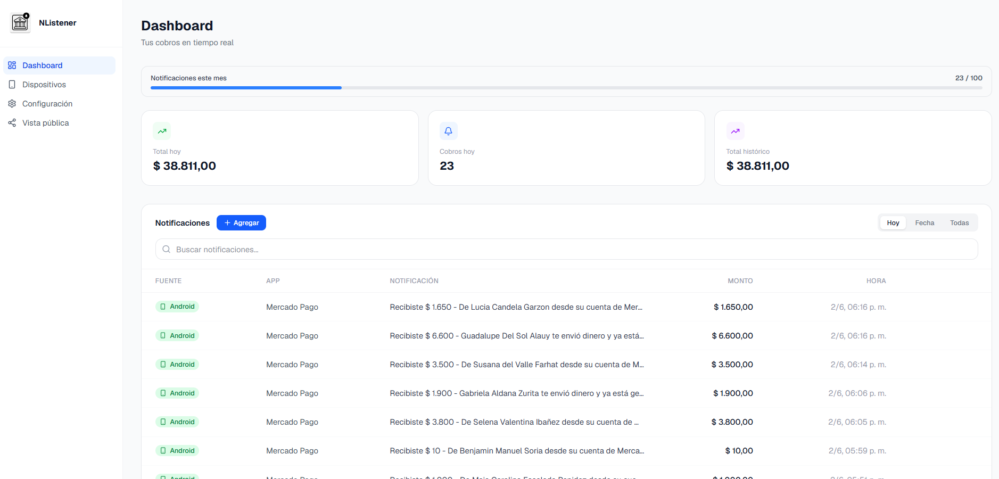
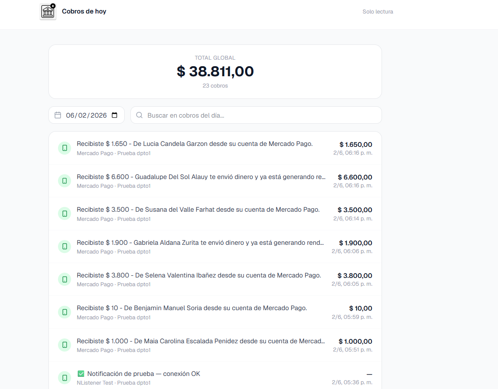
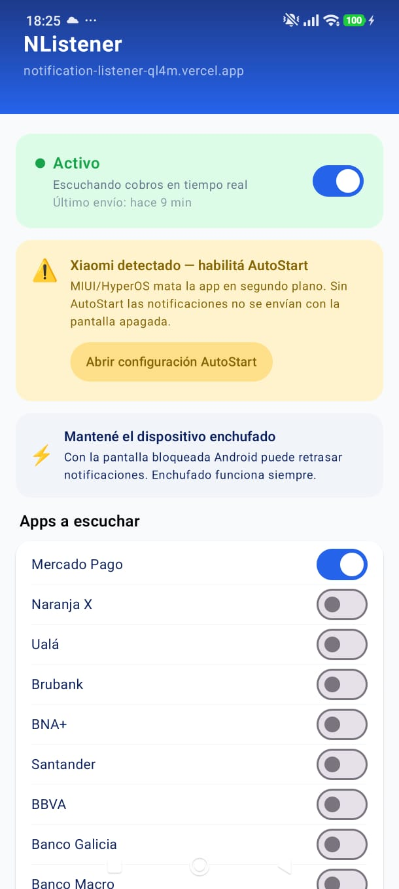

# NListener

**Real-time bank notification sharing for businesses — without sharing bank access.**

NListener solves a common problem for small businesses in Argentina: the owner receives payment notifications on their personal phone, but employees need to confirm payments to serve customers. NListener captures those notifications and displays them on a shared dashboard — no bank credentials shared, no trust issues.

🔗 **Live demo:** [notification-listener-ql4m.vercel.app](https://notification-listener-ql4m.vercel.app)

---

## The Problem

A customer pays via MercadoPago or bank transfer. The employee needs to confirm payment before handing over the product. The owner doesn't want to hand their phone to every employee — and definitely not share their banking app login.

**NListener bridges that gap.**

---

## How It Works

```
Android phone (owner)
  └── NLService captures bank notification (MercadoPago, Galicia, Ualá, etc.)
  └── HTTP POST → /api/notifications (Vercel)
          └── Verifies device token
          └── Stores in Firestore
                  └── Real-time push to all connected clients
                          └── Owner dashboard
                          └── Public employee view (no login required)
```

### Flow

1. **Owner registers** at the web app and verifies their email
2. **Installs NListener Android app** on the phone where bank notifications arrive
3. **Scans a QR code** — the phone is linked to the account with a unique token
4. **Notifications are captured automatically** — when a transfer arrives, `NLService` sends it to the server via HTTP
5. **Employees open a shared link** — they see payments update in real time, no account needed

---

## Features

### Core
- Real-time payment feed via Firestore listeners
- Supports major Argentine payment apps: MercadoPago, Galicia, Ualá, NX, and more
- Public shareable link for employees — no login required
- QR-based device pairing

### Reliability
- **WorkManager** retries failed sends when network recovers
- **KeepAliveService** keeps the listener alive with a foreground service + AlarmManager (every 4 min)
- **FCM remote reconnect** — owner can wake the app remotely even in Android Doze mode

### Business features (Pro plan)
- **Branch mode** — each branch has its own color and password; employees see only their branch's payments; owner sees all with per-branch totals
- **Multi-device** support (up to 5 devices)
- **MercadoPago subscriptions** — monthly billing handled natively
- **Admin panel** — manage users, devices, plans, and pricing

### Plans
|                | Free | Pro |
|----------------|------|---|
| Devices        | 1    | 5 |
| Payments/month | 100  | Unlimited |
| Branch mode    | ✗    | ✓ |

---

## Tech Stack

### Android App
| Technology                  | Purpose |
|-----------------------------|---------|
| Kotlin                      | Primary language |
| Jetpack Compose             | UI |
| NotificationListenerService | Captures system notifications |
| Firebase Messaging (FCM)    | Remote reconnect trigger |
| WorkManager                 | Retry logic on network failure |
| OkHttp                      | HTTP requests to server |
| CameraX + ML Kit            | QR code scanner |
| AlarmManager                | KeepAlive every 4 minutes |

### Web — Frontend
| Technology              | Purpose |
|-------------------------|---------|
| Next.js 15 (App Router) | Framework |
| React 19                | UI |
| Tailwind CSS v4         | Styling |
| Lucide React            | Icons |

### Web — Backend
| Technology         | Purpose |
|--------------------|---------|
| Next.js API Routes | Server-side logic |
| Firebase Admin SDK | Privileged Firestore access |
| Firebase Auth      | User authentication |
| Firestore          | Real-time database |
| Resend             | Transactional emails |
| MercadoPago SDK    | Subscription payments |

### Infrastructure
- **Vercel** — automatic deploys from GitHub
- **Firebase / Firestore** — database and auth
- **GitHub** — version control

---

## Screenshots

> 
  
  

---

## Local Development

```bash
# Clone the repo
git clone https://github.com/YOUR_USERNAME/nlistener.git
cd nlistener

# Install dependencies
npm install

# Set up environment variables
cp .env.example .env.local
# Fill in Firebase, MercadoPago, and Resend credentials

# Run the development server
npm run dev
```

Open [http://localhost:3000](http://localhost:3000) to see the web app.

For the Android app, open the `/android` folder in Android Studio and run on a device or emulator.

---

## Environment Variables

```env
NEXT_PUBLIC_FIREBASE_API_KEY=
NEXT_PUBLIC_FIREBASE_AUTH_DOMAIN=
NEXT_PUBLIC_FIREBASE_PROJECT_ID=
FIREBASE_ADMIN_PRIVATE_KEY=
FIREBASE_ADMIN_CLIENT_EMAIL=
MERCADOPAGO_ACCESS_TOKEN=
RESEND_API_KEY=
```

---

## Author

**Tomás** — Fullstack Developer  
Santiago del Estero, Argentina  
[GitHub](https://github.com/YOUR_USERNAME) · [LinkedIn](https://linkedin.com/in/YOUR_PROFILE)

---

## License

MIT
